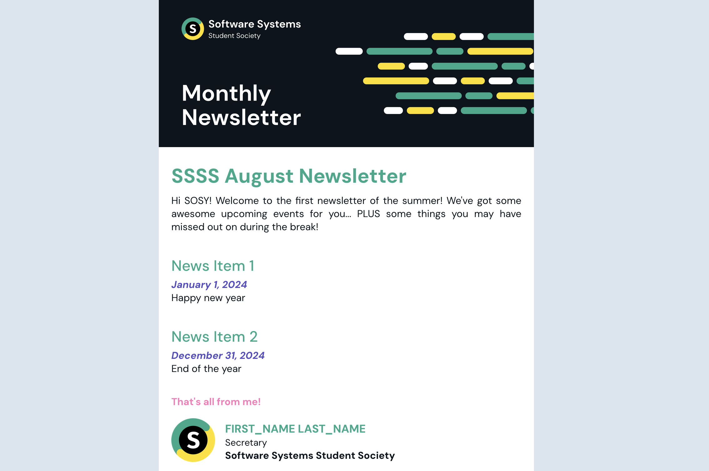

# Software Systems Student Society Newsletter



Templated version of newsletter HTML by Gahee Kim and SFU Women in Computing Science (WiCS).

## Install

Run only once.
```
$ python3 -m venv venv && python3 -m pip install -U -r requirements.txt
```

## Workflow

1. Edit `newsletter.json`
2. `$ source venv/bin/activate && python3 newsletter.py && deactivate`
3. Use `build/build.html`

## Example newsletter.json

Links are only supported under `header.description` and `articles.sections[i].text`.

```
{
  "header": {
    "title": "SSSS October Newsletter",
    "description": "Newsletter description https://www.sfussss.org/"
  },
  "articles": [
    {
      "header": "Item 1",
      "sections": [
        {
          "subheader": "January 1st, 12:00 PM @ SRYE 5050",
          "text": "Text goes here. Visit https://www.sfussss.org/ for more."
        }
      ]
    }
  ],
  "signature": {
    "name": "Gahee Kim",
    "position": "Secretary",
    "endingNote": "And that's all from me! Peace!"
  }
}
```

## Warning

Implementation is intentionally outdated because SFU Mail tends to break new features.
Don't turn the tables into flexboxes, nor use advanced CSS selectors.
Images are referred by CDN because the email use-case necessitates support on a file-systemless reader;
Images aren't embeddable inside HTML (investigate Base64 embedding) so they must be referred externally.
