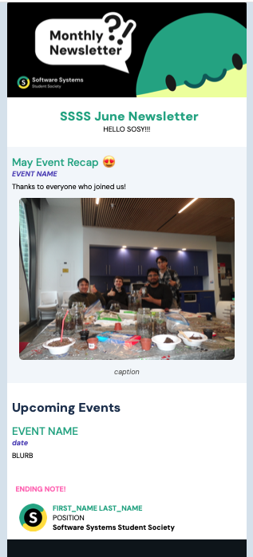

# Software Systems Student Society Newsletter



Templated version of newsletter HTML by Gahee Kim and SFU Women in Computing Science (WiCS). Updatd to support images and separate sections

## Install

Run only once.
```
$ python3 -m venv venv && source venv/bin/activate && python3 -m pip install -U -r requirements.txt
```

## Workflow

1. Edit `newsletter.json`
2. `$ source venv/bin/activate && python3 newsletter.py && deactivate`
3. Use `build/build.html`

## Example newsletter.json

```
{
  "header": {
    "title": "SSSS June Newsletter",
    "description": "HELLO SOSY!!!"
  },

  "recap_articles": [
    {
      "header": "May Event Recap 😍",
      "sections": [
        {
          "subheader": "EVENT NAME",
          "text": [
            "Thanks to everyone who joined us!"
          ],

          "images": [
            {
              "src": "",
              "alt": "alt text",
              "caption": "caption"
            }
          ]
        }
      ]
    }
  ],

  "upcoming_articles": [
    {
      "header": "EVENT NAME",
      "sections": [
        {
          "subheader": "date",
          "text": [
            "BLURB"
          ],
          "images": [
            {
              "src": "",
              "alt": "alt text",
              "caption": "caption"
            } 
          ]
        }
      ]
    }
  ],

  "signature": {
    "name": "FIRST_NAME LAST_NAME",
    "position": "POSITION",
    "endingNote": "ENDING NOTE!"
  }
}
```

### Special Formatting
- `header.description` and `articles[i].sections[j].text`
- Links supported (URL)
- Bold text supported `<b>...</b>`
- Images supported 
  - must upload images to github repo, use `https://raw.githubusercontent.com/ssss-sfu/newsletter/main/src/img/image_name` for image source
  - caption optional
- separate sections supported 
  - set up for event recap and upcoming events,  can update section titles under `index.jinja`

## Warning

Implementation is intentionally outdated because SFU Mail tends to break new features.
Don't turn the tables into flexboxes, nor use advanced CSS selectors.
Images are referred by CDN because the email use-case necessitates support on a file-systemless reader;
Images aren't embeddable inside HTML (investigate Base64 embedding) so they must be referred externally.
